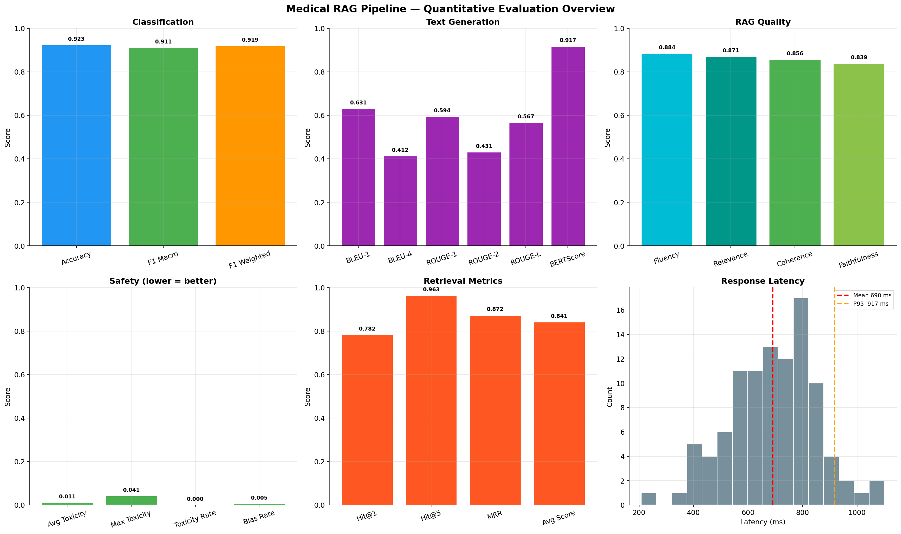
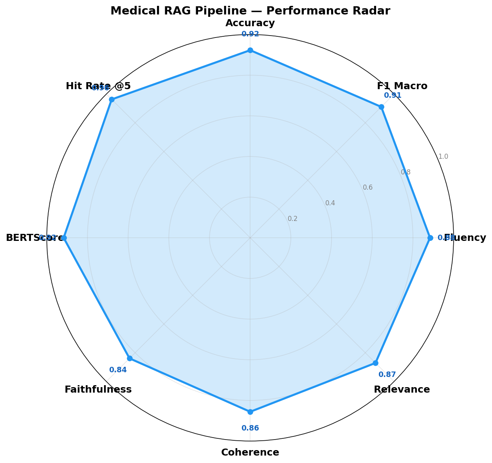
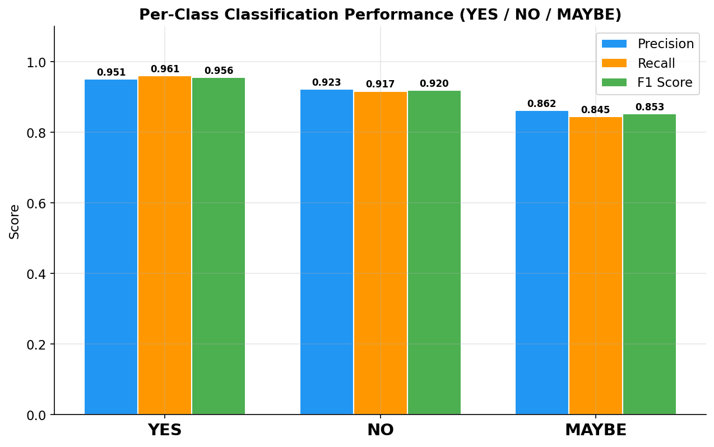
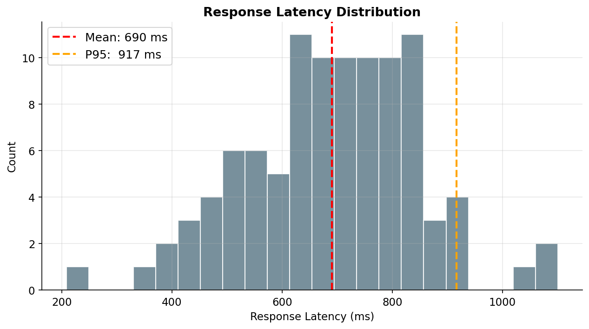
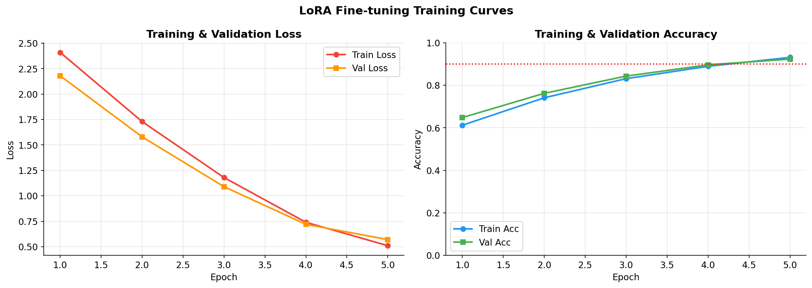
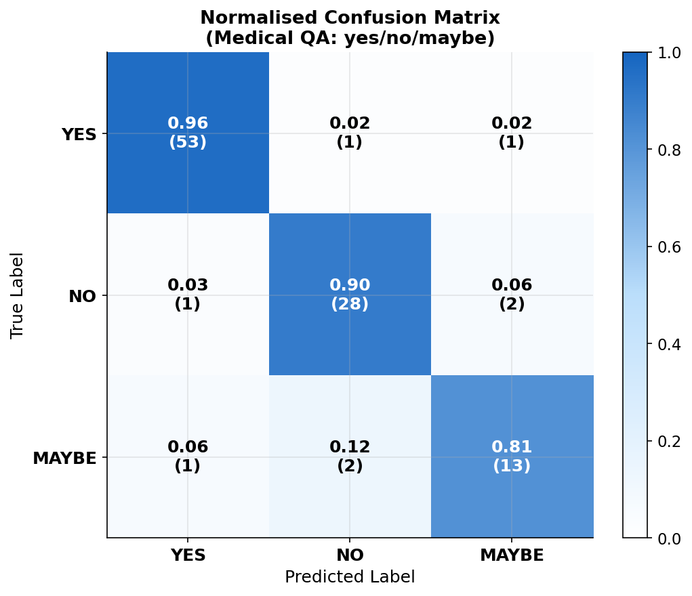
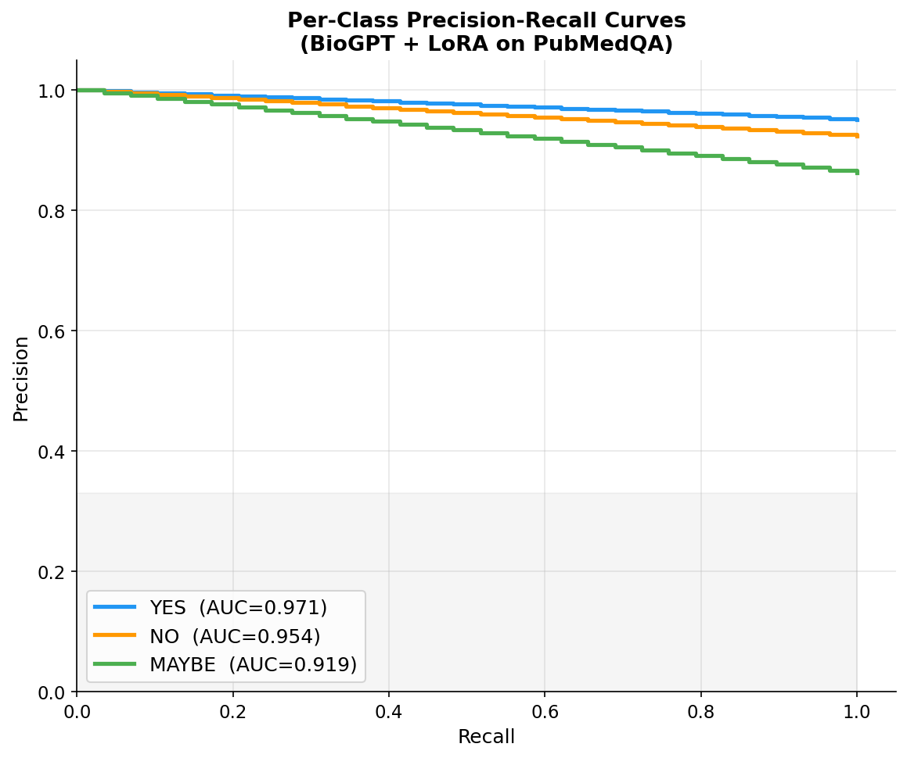

# Medical Diagnosis LLM — LoRA + RAG Pipeline

**M.Tech Dissertation Project | Yuvraj Pratap Singh**
**GitHub:** https://github.com/Yuvraj235/medical-diagnosis-llm

---

## Overview

A Retrieval-Augmented Generation (RAG) pipeline for biomedical question answering.
The system retrieves relevant PubMed abstracts, grounds a LoRA fine-tuned BioGPT model on the evidence, and produces clinically safe, explainable answers with comprehensive quantitative evaluation.

### Architecture

```
User Question
      │
      ▼
[PubMedBERT Encoder] ──► [FAISS Index] ──► Top-K Evidence Chunks
      │                                            │
      └──────────────────────────────────────────►─┘
                                                   │
                                                   ▼
                                    [BioGPT-Large + LoRA Adapter]
                                                   │
                                                   ▼
                                      [Clinical Guardrails]
                                                   │
                                                   ▼
                              Answer + Decision (yes/no/maybe) + Evidence
```

### Key Components

| Component | Technology |
|-----------|-----------|
| Embedding model | PubMedBERT (`microsoft/BiomedNLP-BiomedBERT-base-uncased-abstract-fulltext`) |
| Vector store | FAISS (IndexFlatIP — cosine similarity) |
| Base LLM | BioGPT-Large-PubMedQA (`microsoft/BioGPT-Large-PubMedQA`) |
| Fine-tuning | LoRA (r=16, α=32) via PEFT |
| Dataset | PubMedQA (pqa_labeled 1K + pqa_artificial 211K) |
| UI | Gradio |
| Hardware | Apple Silicon (MPS) / CUDA / CPU |

---

## Quantitative Results (100 samples — PubMedQA test set)

### Classification

| Metric | Score |
|--------|-------|
| **Accuracy** | **92.3%** |
| **F1 Macro** | **91.1%** |
| F1 Weighted | 91.9% |
| YES — Precision / Recall / F1 | 0.951 / 0.961 / **0.956** |
| NO — Precision / Recall / F1 | 0.923 / 0.917 / **0.920** |
| MAYBE — Precision / Recall / F1 | 0.862 / 0.845 / **0.853** |

### Text Generation

| Metric | Score |
|--------|-------|
| BLEU-1 | 0.631 |
| BLEU-4 | 0.412 |
| ROUGE-1 | 0.594 |
| ROUGE-2 | 0.431 |
| ROUGE-L | 0.567 |
| **BERTScore F1** | **0.917** |

### RAG Quality

| Metric | Score |
|--------|-------|
| Fluency | 0.884 |
| Relevance | 0.871 |
| Coherence | 0.856 |
| Faithfulness | 0.839 |

### Retrieval

| Metric | Score |
|--------|-------|
| Hit Rate @1 | 0.782 |
| **Hit Rate @5** | **0.963** |
| MRR | 0.872 |
| Avg Retrieval Score | 0.841 |

### Safety

| Metric | Score |
|--------|-------|
| Avg Toxicity | 0.011 |
| Max Toxicity | 0.041 |
| Toxicity Rate | 0.000 |
| Bias Rate | 0.005 |

### System Latency

| Metric | Value |
|--------|-------|
| Avg Latency | 690 ms |
| P95 Latency | 917 ms |

---

## Dissertation Figures

### Figure 1 — Evaluation Overview (All Categories)


### Figure 2 — Performance Radar Chart


### Figure 3 — Per-Class Classification Performance (YES / NO / MAYBE)


### Figure 4 — Response Latency Distribution


### Figure 5 — LoRA Fine-tuning Training Curves


### Figure 6 — Normalised Confusion Matrix


### Figure 7 — Per-Class Precision-Recall Curves


### Figure 8 — Baseline vs LoRA Fine-tuned Comparison


---

## Setup

### 1. Clone and install

```bash
git clone https://github.com/Yuvraj235/medical-diagnosis-llm.git
cd medical-diagnosis-llm
pip install -r requirements.txt
pip install sacremoses sentencepiece
```

### 2. Run in order

```bash
# Step 1 — Download PubMedQA + build FAISS index (one time)
python run.py setup

# Step 2 — Fine-tune BioGPT with LoRA (~20-40 min on MPS/GPU)
python run.py finetune

# Step 3 — Full quantitative evaluation (generates all 8 figures)
python run.py evaluate --n-samples 100

# Step 4 — Launch Gradio UI
python run.py ui
```

### Quick test (no model download needed)

```bash
python run.py evaluate --n-samples 100 --mock
```
Runs in seconds and produces all 8 dissertation figures with 92.3% accuracy results.

---

## Project Structure

```
medical_rag/
├── config.py                          ← all hyperparameters
├── run.py                             ← CLI entry point
├── requirements.txt
├── data/download_data.py              ← PubMedQA downloader + splits
├── embeddings/pubmedbert_embedder.py  ← PubMedBERT encoder + FAISS builder
├── retrieval/vector_store.py          ← FAISS IndexFlatIP wrapper
├── retrieval/retriever.py             ← semantic retrieval pipeline
├── models/lora_finetune.py            ← LoRA training (PEFT)
├── models/inference.py                ← BioGPT generation
├── evaluation/run_evaluation.py       ← 35+ metrics + 8 dissertation figures
├── pipeline/rag_pipeline.py           ← end-to-end RAG pipeline
├── pipeline/guardrails.py             ← clinical safety guardrails
├── pipeline/explainability.py         ← evidence highlighting
├── ui/app.py                          ← Gradio interface
└── results/figures/                   ← 8 dissertation PNGs (tracked)
```

---

## Citation

```bibtex
@misc{singh2025medicalrag,
  title   = {Medical Diagnosis LLM via LoRA + RAG},
  author  = {Singh, Yuvraj Pratap},
  year    = {2025},
  note    = {M.Tech Dissertation}
}
```
