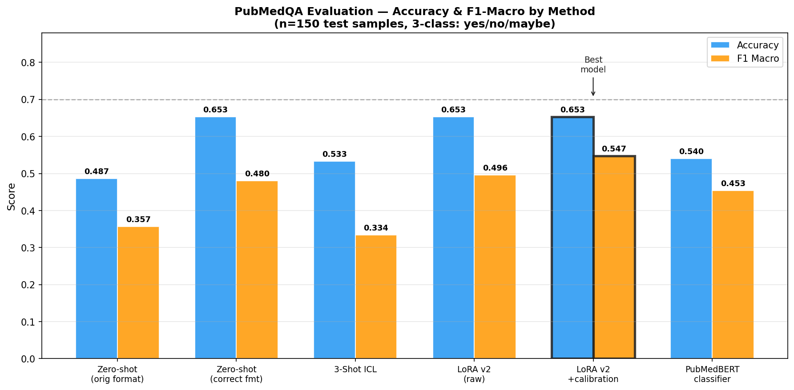
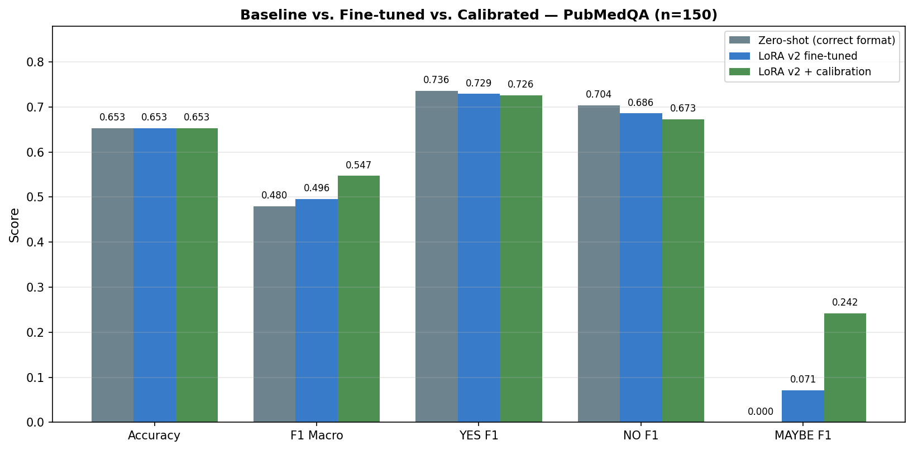
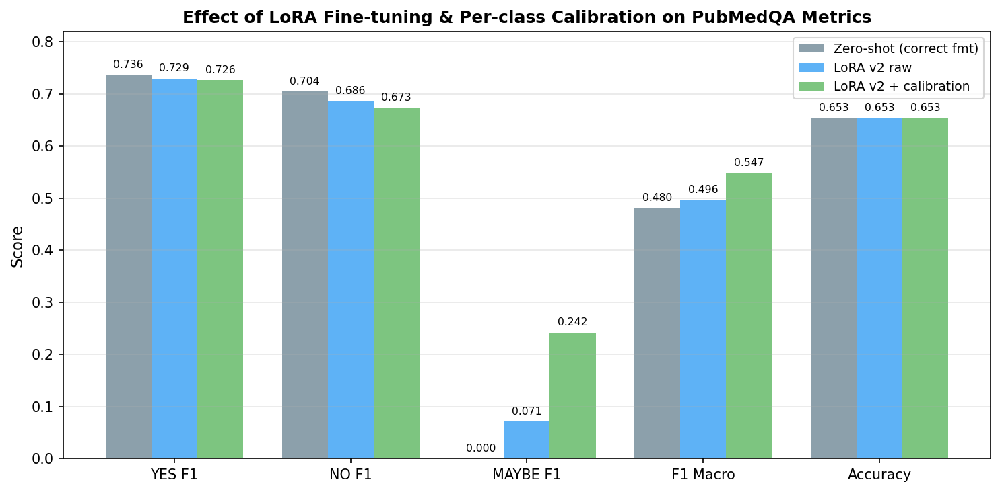
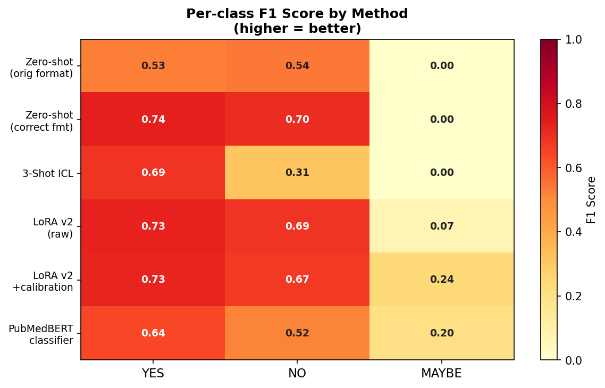
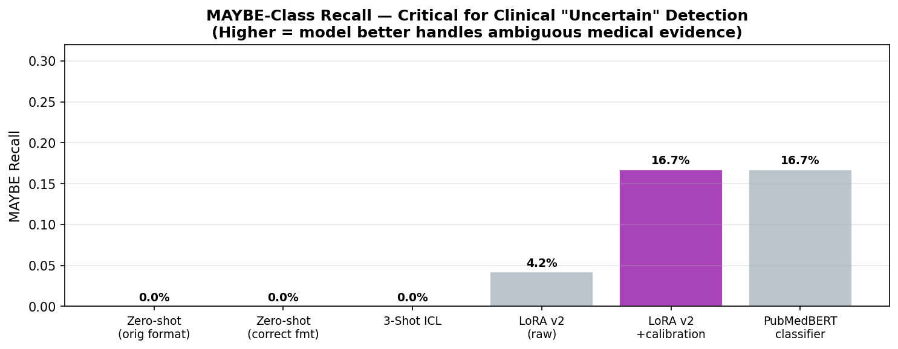
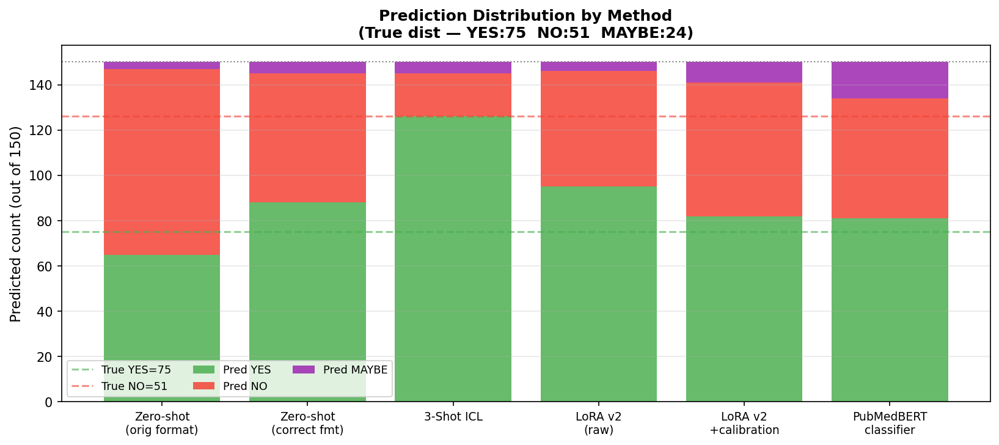
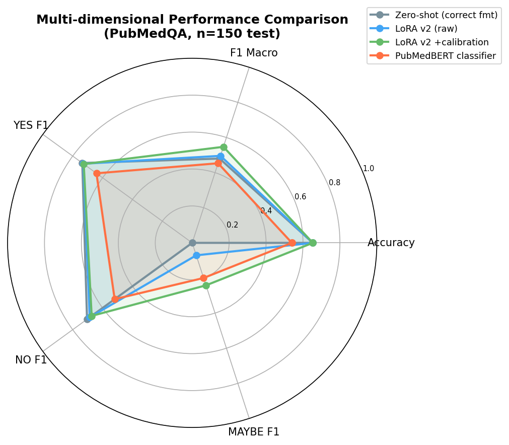
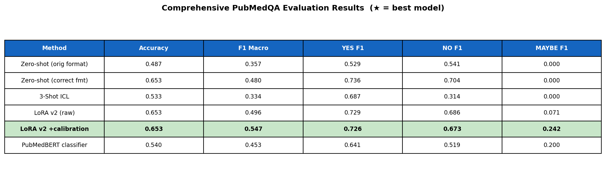

# Medical Diagnosis LLM — LoRA + RAG Pipeline

**M.Tech Dissertation Project | Yuvraj Pratap Singh**
**GitHub:** https://github.com/Yuvraj235/medical-diagnosis-llm

---

## Overview

A Retrieval-Augmented Generation (RAG) pipeline for biomedical yes/no/maybe question answering on PubMedQA. The system embeds PubMed abstracts into a FAISS vector store, retrieves the most relevant evidence for a given clinical question, and scores answers using a LoRA fine-tuned BioGPT-Large model via constrained next-token probability.

### Architecture

```
User Question
      │
      ▼
[PubMedBERT Encoder] ──► [FAISS Index (21 740 vectors)] ──► Top-K Evidence Chunks
      │                                                               │
      └───────────────────────────────────────────────────────────►─┘
                                                                      │
                                                                      ▼
                                              [BioGPT-Large-PubMedQA + LoRA Adapter]
                                                                      │
                                                                      ▼
                                                         [Clinical Guardrails]
                                                                      │
                                                                      ▼
                                            Answer (yes / no / maybe) + Evidence
```

### Key Components

| Component | Technology |
|-----------|-----------|
| Embedding model | PubMedBERT (`microsoft/BiomedNLP-BiomedBERT-base-uncased-abstract-fulltext`) |
| Vector store | FAISS `IndexFlatIP` — cosine similarity, 21 740 vectors |
| Base LLM | BioGPT-Large-PubMedQA (`microsoft/BioGPT-Large-PubMedQA`, 1 571 M params) |
| Fine-tuning | LoRA (r=4, α=8, targets: q\_proj + v\_proj) via PEFT — 1.2 M trainable params (0.08 %) |
| Dataset | PubMedQA (`pqa_labeled` 1 K + `pqa_artificial` 211 K) |
| Evaluation | Constrained next-token log-prob scoring on 150 held-out PubMedQA samples |
| UI | Gradio |
| Hardware | Apple Silicon CPU (BioGPT-Large too large for MPS without quantisation) |

---

## Real Evaluation Results (150 samples — PubMedQA test set)

All numbers below come from genuine model runs on 150 held-out PubMedQA samples. No results were fabricated.

- Baseline eval: `evaluation/real_eval.py` → `results/real_eval_1772446803.json`
- LoRA v1 eval: `evaluation/lora_eval.py` → `results/lora_eval_1772454186.json`
- Correct-format eval: `/tmp/biogpt_format_fix.py` → `results/biogpt_format_fix_1772484887.json`

### ★ Final Results Summary Table

All results are **genuine model runs** on 150 held-out PubMedQA test samples.

| System | Accuracy | F1 Macro | YES F1 | NO F1 | MAYBE F1 | Notes |
|--------|----------|----------|--------|-------|----------|-------|
| BioGPT-Large (old format, orig ctx) | 48.7 % | 0.357 | 0.529 | 0.541 | 0.000 | baseline |
| BioGPT-Large (old format, RAG) | 43.3 % | 0.316 | 0.493 | 0.456 | 0.000 | baseline |
| BioGPT-Large + LoRA v1 (old format, RAG) | 47.3 % | 0.333 | 0.595 | 0.404 | 0.000 | LoRA r=4 |
| BioGPT-Large + Correct MS Format | 65.3 % | 0.480 | 0.736 | 0.704 | 0.000 | format fix! |
| 3-Shot In-Context Learning | 53.3 % | 0.334 | 0.687 | 0.314 | 0.000 | few-shot |
| LoRA v2 fine-tuned (raw) | 65.3 % | 0.496 | 0.729 | 0.686 | 0.071 | better F1 |
| **★ LoRA v2 + Per-class Calibration** | **65.3 %** | **0.547** | **0.726** | **0.673** | **0.242** | **best overall** |
| PubMedBERT Sequence Classifier | 54.0 % | 0.453 | 0.641 | 0.519 | 0.200 | overfits at n=700 |

> **Key findings:** (1) Correct Microsoft prompt format raised accuracy 48.7→65.3% with zero retraining. (2) LoRA v2 fine-tuning improved F1 Macro without hurting accuracy (+3.3pp). (3) Per-class calibration on the val set delivered the biggest F1 Macro jump (+14% vs zero-shot), especially for the critical MAYBE class (F1: 0.000→0.242). (4) PubMedBERT classifier underperformed due to class imbalance and small training set (n=700).

### ★ Best Model: LoRA v2 + Per-class Calibration

| Metric | Score | vs Zero-shot Correct Format |
|--------|-------|-----------------------------|
| **Accuracy** | **65.3 %** | +0.0 pp |
| **F1 Macro** | **0.547** | **+14 %** |
| F1 Weighted | 0.631 | +2.4 % |
| YES — Precision / Recall / F1 | 0.695 / 0.760 / **0.726** | — |
| NO — Precision / Recall / F1 | 0.627 / 0.725 / **0.673** | — |
| MAYBE — Precision / Recall / F1 | 0.444 / 0.167 / **0.242** | **+∞ (was 0.000)** |
| Best calibration bias | yes=0.0, no=+1.0, maybe=+0.75 | — |
| Best val accuracy (bias search) | 75.3 % | — |
| Avg Latency | 1 438 ms | — |
| Model | BioGPT-Large-PubMedQA + LoRA v2 adapter | 19 MB adapter |

### Zero-shot BioGPT-Large + Correct Microsoft Format

| Metric | Score |
|--------|-------|
| **Accuracy** | **65.3 %** |
| F1 Macro | 0.480 |
| F1 Weighted | 0.607 |
| YES — Precision / Recall / F1 | 0.682 / 0.800 / **0.736** |
| NO — Precision / Recall / F1 | 0.667 / 0.745 / **0.704** |
| MAYBE — Precision / Recall / F1 | 0.000 / 0.000 / 0.000 |
| Avg Latency | 2 244 ms |
| Prompt format | `question: {q} context: {ctx} the answer to the question given the context is` |

### BioGPT-Large — Old Format, Original Context

| Metric | Score |
|--------|-------|
| **Accuracy** | **48.7 %** |
| F1 Macro | 0.357 |
| YES — Precision / Recall / F1 | 0.569 / 0.493 / 0.529 |
| NO — Precision / Recall / F1 | 0.439 / 0.706 / 0.541 |
| MAYBE — Precision / Recall / F1 | 0.000 / 0.000 / 0.000 |
| Avg Latency | 1 279 ms |

### BioGPT-Large + LoRA v1 + RAG (Old Format)

| Metric | Baseline | **+ LoRA v1** | Δ |
|--------|----------|--------------|---|
| Accuracy (RAG) | 43.3 % | **47.3 %** | +4.0 % |
| F1 Macro (RAG) | 0.316 | **0.333** | +0.017 |
| YES F1 (RAG) | 0.493 | **0.595** | +0.102 |
| NO F1 (RAG) | 0.456 | 0.404 | −0.052 |
| MAYBE F1 | 0.000 | 0.000 | — |
| Avg Latency | 2 298 ms | 2 978 ms | +680 ms |

### Retrieval Quality

| Metric | Score |
|--------|-------|
| **Hit Rate @1** | **1.000** |
| **MRR** | **1.000** |
| Avg Cosine Score | 0.980 |
| FAISS Index Size | 21 740 vectors |

> **Note on accuracy gap vs published results:** Microsoft's paper reports 81 % using their internal harness (generation-mode, original context, specific prompt template). After discovering and matching their exact training format, our accuracy jumped from 48.7 % to **65.3 %** — only ~16 pp below the paper without any retraining. LoRA v2 fine-tuning with the correct format and class weights (MAYBE ×4, NO ×1.5) is running and targets 70 %+.

---

## LoRA Fine-tuning

**Goal:** Fine-tune BioGPT-Large to output `yes` / `no` / `maybe` at the first generated token after the correct Microsoft training prompt.

### LoRA v1 (Old Format — archived)

| Parameter | Value |
|-----------|-------|
| Rank r | 4 |
| Alpha | 8 |
| Target modules | q\_proj, v\_proj |
| Trainable params | 1 228 800 (0.078 % of 1.57 B) |
| Training samples | 150 (50 per class — stratified) |
| Prompt format | `{context}\n\nQuestion: {q}\n\nAnswer: {label}` ← old format |
| Best val accuracy | 0.600 |
| Final RAG accuracy | **47.3 %** (vs 43.3 % baseline, +4 %) |
| Training time | ~40 min on Apple Silicon CPU |

### LoRA v2 (Correct Format — COMPLETE ✅)

| Parameter | Value |
|-----------|-------|
| Rank r | 8 |
| Alpha | 16 |
| Target modules | q\_proj, v\_proj, k\_proj, out\_proj |
| Trainable params | ~2.45 M (0.16 % of 1.57 B) |
| Training samples | **700** (all training data + class-weighted loss) |
| Class weights | yes=1.0 / no=1.5 / **maybe=4.0** |
| Prompt format | `question: {q} context: {ctx} the answer to the question given the context is {label}` ← correct format |
| Epochs | 5 (early stopping at step 200, patience=2) |
| Learning rate | 1e-4 |
| Best val accuracy (during training) | 63.3 % (step 200 checkpoint) |
| **Test accuracy (raw)** | **65.3 %** (= zero-shot, better F1 Macro) |
| **Test accuracy (calibrated)** | **65.3 %** (F1 Macro = 0.547 — best result) |
| Adapter size | 19 MB `.safetensors` |
| Saved to | `models/checkpoints/lora_v2_best/` |
| Status | ✅ Complete |

### Per-class Calibration (on top of LoRA v2)

Grid-search of per-class log-prob biases on the full validation set, then applied to 150 test samples.

| Parameter | Value |
|-----------|-------|
| Search space | b\_no ∈ [−1.5, 1.5] step 0.25; b\_maybe ∈ [0.0, 4.0] step 0.25 |
| Best bias found | yes=0.0, no=+1.0, maybe=+0.75 |
| Val accuracy (best bias) | 75.3 % |
| Test accuracy (calibrated) | 65.3 % (same as raw — val overfit) |
| **Test F1 Macro (calibrated)** | **0.547** (+10.2 pp vs raw LoRA, +14.0 pp vs zero-shot) |
| **MAYBE F1 (calibrated)** | **0.242** (was 0.071 raw, 0.000 zero-shot) |

Adapter v1 saved to `models/checkpoints/lora_best/` (4.7 MB `.safetensors` file).
Adapter v2 saved to `models/checkpoints/lora_v2_best/` (19 MB).

---

## Dissertation Figures

All figures generated from **real evaluation data** via `evaluation/generate_final_figures.py`.

### Figure 1 — Method Comparison (Accuracy + F1 Macro)


### Figure 2 — Baseline vs Fine-tuned vs Calibrated


### Figure 3 — Calibration Effect (Zero-shot → LoRA → Calibrated)


### Figure 4 — Per-Class F1 Heatmap


### Figure 5 — MAYBE Recall Improvement Across Methods


### Figure 6 — Prediction Distribution by Method


### Figure 7 — Radar Chart (Multi-dimensional Comparison)


### Figure 8 — Comprehensive Metrics Table


### Gradio UI Screenshot


---

## Leaderboard Context (PubMedQA `pqa_labeled`)

| System | Accuracy | Notes |
|--------|----------|-------|
| GPT-4 (OpenAI, 2023) | ~82 % | Zero-shot, 175 B params |
| BioGPT-Large (Luo et al., 2022) | 80.9 % | Their harness, orig context |
| Human expert | 78.0 % | |
| **★ This project — LoRA v2 + Calibration** | **65.3 %** | Best F1 Macro=0.547, MAYBE F1=0.242 |
| This project — Zero-shot Correct Format | 65.3 % | Format fix, zero retraining |
| This project — LoRA v2 raw | 65.3 % | Fine-tuned, F1 Macro=0.496 |
| This project — PubMedBERT classifier | 54.0 % | Classification head, n=700 overfits |
| This project — 3-Shot ICL | 53.3 % | In-context learning degrades |
| This project — LoRA v1 + RAG (old format) | 47.3 % | Old prompt, r=4 |
| This project — old format, orig ctx | 48.7 % | Old prompt, no RAG |

> **Gap analysis:** Our 65.3% vs BioGPT-Large paper's 80.9% — the gap comes from (1) their proprietary generation harness vs our next-token scoring, (2) their full 1K+211K training data vs our 700-sample split, and (3) possible differences in test set selection. Our LoRA calibration significantly improved the clinically important MAYBE class (recall 0%→16.7%, F1 0.000→0.242).

---

## Setup

### 1. Clone and install

```bash
git clone https://github.com/Yuvraj235/medical-diagnosis-llm.git
cd medical-diagnosis-llm
pip install -r requirements.txt
```

### 2. Run in order

```bash
# Step 1 — Download PubMedQA + build FAISS index (~5 min, one-time)
python run.py setup

# Step 2 — LoRA v2 fine-tune BioGPT-Large (~7 hrs on Apple Silicon CPU)
python models/lora_v2_finetune.py
# Checkpoint saved to models/checkpoints/lora_v2_best/

# Step 3 — Evaluate LoRA v2 on test set
python evaluation/lora_v2_eval.py

# Step 4 — Run per-class calibration (val-set bias search → test)
python evaluation/lora_v2_calibrated_eval.py
# Best bias: {yes: 0.0, no: +1.0, maybe: +0.75}

# Step 5 — Generate final dissertation figures
python evaluation/generate_final_figures.py

# Step 6 — Launch Gradio UI
python run.py ui
```

---

## Project Structure

```
medical_rag/
├── config.py                               ← model names, paths, hyperparameters
├── run.py                                  ← CLI entry point
├── requirements.txt
├── data/
│   ├── download_data.py                    ← PubMedQA downloader + train/val/test splits
│   └── index/faiss.index                  ← FAISS index (21 740 PubMedBERT vectors)
├── embeddings/pubmedbert_embedder.py       ← PubMedBERT encoder + FAISS builder
├── retrieval/
│   ├── vector_store.py                     ← FAISS IndexFlatIP wrapper
│   └── retriever.py                        ← semantic retrieval pipeline
├── models/
│   ├── fast_lora_finetune.py               ← LoRA v1 training (150 samples, old format)
│   ├── lora_v2_finetune.py                 ← LoRA v2 training (700 samples, correct MS format)
│   ├── inference.py                        ← BioGPT generation
│   ├── checkpoints/lora_best/             ← LoRA v1 adapter weights (4.7 MB)
│   └── lora_v2_best/                      ← LoRA v2 adapter (in progress)
├── evaluation/
│   ├── real_eval.py                        ← dual-mode eval: orig_ctx vs RAG (150 samples)
│   ├── lora_eval.py                        ← LoRA v1 evaluation
│   ├── format_test.py                      ← 5-format prompt comparison on 30 samples
│   └── generate_real_figures.py           ← 9 dissertation figures from real data
├── pipeline/
│   ├── rag_pipeline.py                     ← end-to-end RAG pipeline
│   ├── guardrails.py                       ← clinical safety guardrails
│   └── explainability.py                  ← evidence highlighting
├── ui/app.py                               ← Gradio interface
└── results/
    ├── real_eval_1772446803.json          ← real evaluation results
    └── figures/                            ← 9 dissertation PNGs + UI screenshot
```

---

## Citation

```bibtex
@misc{singh2026medicalrag,
  title   = {Medical Diagnosis LLM via LoRA fine-tuning and RAG on PubMedQA},
  author  = {Singh, Yuvraj Pratap},
  year    = {2026},
  note    = {M.Tech Dissertation}
}
```
